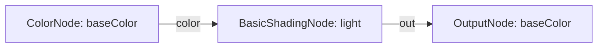
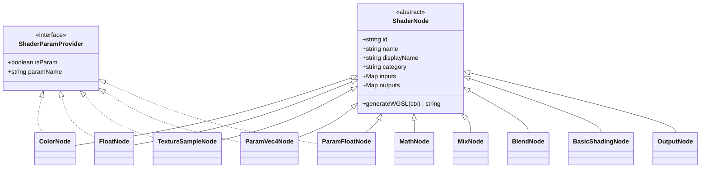

# WeebRender Shader Graph & Node Architecture

Compiles node-socket computation DAGs into WebGPU WGSL pipelines with uniform buffers and bind group layouts.

---

## Table of Contents

1. [Architecture & Philosophy](#architecture--philosophy)
2. [Socket System](#socket-system)
   - [Types](#types)
   - [InputSocket & OutputSocket](#inputsocket--outputsocket)
3. [Node Reference by Domain](#node-reference-by-domain)
   - [Base](#base-shadernode)
   - [Color Domain](#color-domain)
     - [ColorNode](#colornode)
     - [ConstColorNode](#constcolornode)
     - [TextureSampleNode](#texturesamplenode)
     - [BlendNode (ColorMixNode)](#blendnode-colormixnode)
   - [Math Domain](#math-domain)
     - [FloatNode](#floatnode)
     - [ConstFloatNode](#constfloatnode)
     - [MathNode](#mathnode)
     - [MixNode](#mixnode)
   - [Parameter Domain](#parameter-domain)
     - [ShaderParamProvider & isShaderParam](#shaderparamprovider--isshaderparam)
     - [ParamVec4Node](#paramvec4node)
     - [ParamFloatNode](#paramfloatnode)
   - [Shading Domain](#shading-domain)
     - [BasicShadingNode](#basicshadingnode)
   - [Output Domain](#output-domain)
     - [OutputNode](#outputnode)
4. [WebGPU Memory Layout & Compilation](#webgpu-memory-layout--compilation)
   - [Topological Sorting](#topological-sorting)
   - [Uniform Buffer Alignment](#uniform-buffer-alignment)
   - [Bind Group 2 Structure](#bind-group-2-structure)
5. [Shader Runtime & Parameter Instances](#shader-runtime--parameter-instances)
   - [Universal Stride Adaptation](#universal-stride-adaptation)
   - [Parameter Factory API](#parameter-factory-api)
   - [Cache Invalidation](#cache-invalidation)
6. [ECS Material Integration (MaterialCmp)](#ecs-material-integration-materialcmp)
7. [Complete Code Examples](#complete-code-examples)

---

## Architecture & Philosophy

The Shader Graph uses [`Adataflow`](file:///C:/Users/Admin/Downloads/AsczSuperWeeb/Atoolkit/adataflow/index.ts) DAG evaluation, compiling connected node graphs into WebGPU WGSL vertex and fragment pipelines.



### Key Principles

- **Pure Computation Nodes**: Operators like `MathNode`, `MixNode`, `BlendNode`, and `BasicShadingNode` generate WGSL expressions without allocating uniform buffer space.
- **Explicit Parameter Isolation**: Only nodes implementing `ShaderParamProvider` introduce uniform buffer offsets or texture bind entries.
- **Three-Tier Data Model**:
  1. *Structural (Wires and Operations)*: Requires WGSL shader compilation.
  2. *Dynamic Parameters*: Uploaded through uniform buffers without pipeline recompilation.
  3. *Inline Constants*: Inlined into WGSL for compile-time folding and GPU register efficiency.

---

## Socket System

Defined in [`types.ts`](file:///C:/Users/Admin/Downloads/AsczSuperWeeb/WeebRender/shader/types.ts):

### Types

```typescript
export type SocketType = "float" | "vec2" | "vec3" | "vec4" | "texture2d";
```

| SocketType | WGSL Type | Equivalent In JS/TS | Purpose |
| :--- | :--- | :--- | :--- |
| `"float"` | `f32` | `number` | Scalar factors, mix weights, opacity, thresholds. |
| `"vec2"` | `vec2<f32>` | `[number, number]` | UV texture coordinates, 2D vectors. |
| `"vec3"` | `vec3<f32>` | `[number, number, number]` | Light directions, normals, RGB vectors. |
| `"vec4"` | `vec4<f32>` | `[number, number, number, number]` | RGBA colors, homogenous vectors. |
| `"texture2d"` | `texture_2d<f32>` | [`Texture`](file:///C:/Users/Admin/Downloads/AsczSuperWeeb/WeebRender/texture.ts) | 2D texture map references. |

---

### InputSocket & OutputSocket

Sockets are typed input and output ports on nodes. When two sockets are linked by an edge in the graph:
```wgsl
let destination_input = source_node_prefix_socketName;
```

If an input socket is unconnected, the node provides a deterministic fallback value.

---

## Node Reference by Domain

All nodes are organized into modular, domain-driven files under [`nodes/`](file:///C:/Users/Admin/Downloads/AsczSuperWeeb/WeebRender/shader/nodes/index.ts).



---

### Base: ShaderNode

File: [`nodes/base.ts`](file:///C:/Users/Admin/Downloads/AsczSuperWeeb/WeebRender/shader/nodes/base.ts)

Root abstract class for all nodes, extending `Adfnode` from `Atoolkit/adataflow`. Declares typed input and output sockets and defines the `generateWGSL` code generation contract.

```typescript
export abstract class ShaderNode extends Adfnode {
    displayName: string;
    category: NodeCategory; // "input" | "math" | "color" | "shading" | "output"

    abstract generateWGSL(ctx: NodeCompileContext): string;
}
```

---

### Color Domain

File: [`nodes/color.ts`](file:///C:/Users/Admin/Downloads/AsczSuperWeeb/WeebRender/shader/nodes/color.ts)

Handles color generation, inline constants, texture texel sampling, and color blending operations.

#### ColorNode
Emits a `vec4` color. Operates as an inline constant literal or registers a uniform parameter if `isParam: true` or `paramName` is provided.

- **Sockets**:
  - Outputs: `"color"` (`vec4`), `"rgb"` (`vec3`), `"alpha"` (`float`).
- **Constructor**:
  ```typescript
  new ColorNode(id: string, options?: ColorNodeOptions)
  // or legacy: new ColorNode(id, [1, 1, 1, 1], isParam, paramName)
  ```
- **Generated WGSL**:
  - *Constant*: `let prefix_color: vec4<f32> = vec4<f32>(1.0, 0.5, 0.0, 1.0);`
  - *Parameter*: `let prefix_color: vec4<f32> = uMaterial.baseColor;`

#### ConstColorNode
Dedicated inline constant color node. Guaranteed to emit compile-time literals with zero uniform buffer overhead.

- **Constructor**: `new ConstColorNode(id: string, color?: number[])`

#### TextureSampleNode
Samples a 2D texture at the specified UV coordinates using WebGPU texture and filtering sampler bindings.

- **Sockets**:
  - Inputs: `"uv"` (`vec2`, fallback: `in.uv`).
  - Outputs: `"color"` (`vec4`), `"rgb"` (`vec3`), `"alpha"` (`float`).
- **Constructor**:
  ```typescript
  new TextureSampleNode(id: string, options?: TextureSampleOptions)
  // or legacy: new TextureSampleNode(id, texture, isParam, paramName)
  ```
- **Generated WGSL**:
  ```wgsl
  let prefix_color: vec4<f32> = textureSample(t_tex_0, s_tex_0, in.uv);
  let prefix_rgb: vec3<f32> = prefix_color.rgb;
  let prefix_alpha: f32 = prefix_color.a;
  ```

#### BlendNode (ColorMixNode)
Combines two color streams using selectable arithmetic or interpolation modes:
- `0`: Multiply (`a * b`)
- `1`: Add (`clamp(a + b, 0.0, 1.0)`)
- `2`: Subtract (`clamp(a - b, 0.0, 1.0)`)
- `3`: Mix / Linear Interpolation (`mix(a, b, factor)`)
- `4`: Solo A (`a`)
- `5`: Solo B (`b`)
- `6`: Divide (`clamp(a / max(b, 0.0001), 0.0, 1.0)`)

- **Sockets**:
  - Inputs: `"a"` (`vec4`), `"b"` (`vec4`), `"mode"` (`float`), `"factor"` (`float`).
  - Output: `"out"` (`vec4`).
- **Constructor**:
  ```typescript
  new BlendNode(id: string, options?: BlendNodeOptions)
  // or legacy: new BlendNode(id, defaultMode, defaultFactor)
  ```

---

### Math Domain

File: [`nodes/math.ts`](file:///C:/Users/Admin/Downloads/AsczSuperWeeb/WeebRender/shader/nodes/math.ts)

Handles scalar numeric values and arithmetic operations.

#### FloatNode
Emits a scalar float. Operates as an inline constant literal or registers a uniform parameter if `isParam: true` or `paramName` is provided.

- **Sockets**:
  - Output: `"value"` (`float`).
- **Constructor**:
  ```typescript
  new FloatNode(id: string, options?: FloatNodeOptions)
  // or legacy: new FloatNode(id, 0.5, isParam, paramName)
  ```

#### ConstFloatNode
Dedicated inline constant float node. Guaranteed zero uniform buffer overhead.

- **Constructor**: `new ConstFloatNode(id: string, value?: number)`

#### MathNode
Performs component-wise arithmetic operations between two `vec4` inputs.

- **Sockets**:
  - Inputs: `"a"` (`vec4`), `"b"` (`vec4`).
  - Output: `"out"` (`vec4`).
- **Operations**: `"add"`, `"multiply"`, `"subtract"`, `"divide"`.
- **Constructor**:
  ```typescript
  new MathNode(id: string, optionsOrOp?: MathNodeOptions | MathOperation)
  ```
- **Generated WGSL**:
  ```wgsl
  let prefix_out = prefix_a * prefix_b;
  ```

#### MixNode
Performs linear interpolation between two `vec4` inputs: `mix(a, b, factor) = a * (1 - factor) + b * factor`.

- **Sockets**:
  - Inputs: `"a"` (`vec4`), `"b"` (`vec4`), `"factor"` (`float`, fallback: `0.5`).
  - Output: `"out"` (`vec4`).
- **Constructor**:
  ```typescript
  new MixNode(id: string, optionsOrDefaultFactor?: MixNodeOptions | number)
  ```
- **Generated WGSL**:
  ```wgsl
  let prefix_out = mix(prefix_a, prefix_b, prefix_factor);
  ```

---

### Parameter Domain

File: [`nodes/params.ts`](file:///C:/Users/Admin/Downloads/AsczSuperWeeb/WeebRender/shader/nodes/params.ts)

Houses parameter-specific interfaces and dedicated uniform binding nodes.

#### ShaderParamProvider & isShaderParam
Contract implemented by nodes that register uniform buffer allocations or texture bindings:
```typescript
export interface ShaderParamProvider {
    readonly isParam: boolean;
    readonly paramName?: string;
}
export function isShaderParam(node: unknown): node is ShaderParamProvider;
```

#### ParamVec4Node
Dedicated uniform parameter node for `vec4<f32>` values. Automatically aligned to 16 bytes in `@group(2) @binding(0)`.

- **Sockets**:
  - Outputs: `"color"` (`vec4`), `"rgb"` (`vec3`), `"alpha"` (`float`).
- **Constructor**:
  ```typescript
  new ParamVec4Node(id: string, paramName: string, defaultValue?: number[])
  ```

#### ParamFloatNode
Dedicated uniform parameter node for `f32` scalar values. Automatically aligned to 4 bytes in `@group(2) @binding(0)`.

- **Sockets**:
  - Output: `"value"` (`float`).
- **Constructor**:
  ```typescript
  new ParamFloatNode(id: string, paramName: string, defaultValue?: number)
  ```

---

### Shading Domain

File: [`nodes/shading.ts`](file:///C:/Users/Admin/Downloads/AsczSuperWeeb/WeebRender/shader/nodes/shading.ts)

Handles lighting and surface illumination models.

#### BasicShadingNode (1-Wire Shading)
Receives surface color through a single 1-wire input socket (`"color"`), calculates directional key light, fill light, and ambient illumination based on vertex normal, and outputs the shaded color.

Connecting this node produces lit surfaces; bypassing it keeps colors unshaded as raw emissive/unlit tones.

- **Sockets**:
  - Inputs:
    - `"color"` (`vec4`): Primary surface color input (1 wire).
    - `"ambient"` (`float`, fallback: `0.28`): Ambient illumination scalar.
    - `"diffuse"` (`float`, fallback: `0.72`): Key light diffuse multiplier.
    - `"lightDir"` (`vec3`, fallback: `[0.5, 0.8, 0.6]`): Direction toward main light source.
  - Output: `"out"` (`vec4`).
- **Constructor**:
  ```typescript
  new BasicShadingNode(id: string, options?: BasicShadingOptions)
  // or legacy: new BasicShadingNode(id, ambient, diffuse, lightDir)
  ```
- **Generated WGSL**:
  ```wgsl
  let prefix_normLen = length(in.normal);
  let prefix_N = select(vec3<f32>(0.0, 1.0, 0.0), in.normal / max(prefix_normLen, 0.0001), prefix_normLen > 0.0001);
  let prefix_keyDir = normalize(vec3<f32>(0.5, 0.8, 0.6));
  let prefix_keyDiff = max(dot(prefix_N, prefix_keyDir), 0.0);
  let prefix_fillDir = normalize(vec3<f32>(-0.6, 0.2, -0.4));
  let prefix_fillDiff = max(dot(prefix_N, prefix_fillDir), 0.0) * 0.35;
  let prefix_intensity = 0.2800 + prefix_keyDiff * 0.7200 + prefix_fillDiff;
  let prefix_out = vec4<f32>(prefix_inColor.rgb * prefix_intensity, prefix_inColor.a);
  ```

---

### Output Domain

File: [`nodes/output.ts`](file:///C:/Users/Admin/Downloads/AsczSuperWeeb/WeebRender/shader/nodes/output.ts)

Terminal sink node of a shader graph. Automatically provided on `graph.outputNode`.

#### OutputNode
- **Sockets**:
  - Inputs:
    - `"baseColor"` (`vec4`, fallback: `vec4(1.0)`): Final surface color.
    - `"alpha"` (`float`, optional): Opacity factor.
    - `"emissive"` (`vec3`, optional): Emissive color contribution.
- **Constructor**: `new OutputNode(id = "output")`
- **Generated WGSL**:
  ```wgsl
  var finalSurfaceColor = prefix_baseColor;
  finalSurfaceColor.a = finalSurfaceColor.a * (prefix_alpha);
  finalSurfaceColor = vec4<f32>(finalSurfaceColor.rgb + (prefix_emissive), finalSurfaceColor.a);
  ```

---

## WebGPU Memory Layout & Compilation

Handled by [`ShaderGraph.compile()`](file:///C:/Users/Admin/Downloads/AsczSuperWeeb/WeebRender/shader/graph.ts#L47):

1. **Topological Sorting**: Resolves upstream-to-downstream execution order via graph DAG traversal.
2. **Memory Packing (std140)**:
   - `vec4`: Aligned to 16 bytes.
   - `float`: Aligned to 4 bytes.
   - Total uniform buffer rounded up to a multiple of 16 bytes.
3. **Pre-baked Float32Array**: The compiler produces `paramLayout.defaultUniformData`, baking all default values into contiguous bytes once at compile time.

### Bind Group 2 Structure

| Binding | Resource Type | Description |
| :--- | :--- | :--- |
| `@binding(0)` | `var<uniform> uMaterial: MaterialUniforms` | Packed uniform buffer containing all parameters. |
| `@binding(1)` | `var t_tex_0: texture_2d<f32>` | Texture 0 resource view. |
| `@binding(2)` | `var s_tex_0: sampler` | Texture 0 sampler. |
| `@binding(1 + 2*i)` | `var t_tex_i: texture_2d<f32>` | Texture i resource view. |
| `@binding(2 + 2*i)` | `var s_tex_i: sampler` | Texture i sampler. |

---

## Shader Runtime & Parameter Instances

File: [`WeebRender/shader/shader.ts`](file:///C:/Users/Admin/Downloads/AsczSuperWeeb/WeebRender/shader/shader.ts)

The [`Shader`](file:///C:/Users/Admin/Downloads/AsczSuperWeeb/WeebRender/shader/shader.ts) instance wraps a compiled blueprint and manages WebGPU pipelines, parameter instantiation, and cache invalidation.

### Universal Stride Adaptation

Each compiled blueprint emits both static (stride 32) and skinned (stride 64) WGSL entry points. Calling `shader.getOrCreatePipeline(device, format, stride, ...)` lazily compiles and caches the matching pipeline:
- **Stride 32 (Static)**: 3 bind group layouts (Camera, Object, Material) with a 3-attribute vertex buffer layout (`position`, `normal`, `uv`).
- **Stride 64 (Skinned)**: 4 bind group layouts (Camera, Object, Material, Skin Storage) with a 5-attribute vertex buffer layout (`position`, `normal`, `uv`, `joints`, `weights`).

Shaders operate on both static and rigged geometry without requiring separate shader definitions.

### Parameter Factory API

Provides ready-to-use parameter records and ECS components pre-filled with graph defaults:

```typescript
// 1. Cloned parameter record populated with blueprint defaults
const params: MaterialParamRecord = shader.createDefaultParams();
// Returns: { baseColor: [0.25, 0.65, 0.95, 1.0], mainTexture: Texture | null }

// 2. Ready-to-assign ECS component with optional overrides
const paramsCmp: ShaderParamsCmp = shader.createParamsCmp({
    baseColor: [1.0, 0.0, 0.0, 1.0],
});

// 3. Single parameter query
const defaultTint = shader.getDefaultParam("baseColor");

// 4. Parameter inspection
const exists = shader.hasParam("tintColor");
const names = shader.getParamNames(); // ["baseColor", "blendMode", "mainTexture"]
```

### Cache Invalidation

Calling `shader.invalidateGpu()` clears all cached render pipelines, shader modules, and pipeline layouts across all strides, allowing hot-reloading without replacing the shader instance.

---

## ECS Material Integration (MaterialCmp)

File: [`WeebRender/material.ts`](file:///C:/Users/Admin/Downloads/AsczSuperWeeb/WeebRender/material.ts)

[`MaterialCmp`](file:///C:/Users/Admin/Downloads/AsczSuperWeeb/WeebRender/material.ts#L16) is the canonical ECS component for assigning shaders and parameter overrides to entities:

```typescript
export class MaterialCmp extends Acmp {
    shaders: (Shader | null)[];
    params: (MaterialParamRecord | null)[];

    constructor(
        shaders?: (Shader | null)[] | Shader,
        params?: (MaterialParamRecord | null)[] | MaterialParamRecord
    );

    setShader(slot: number, shader: Shader | null): this;
    setParam(slot: number, paramName: string, value: MaterialParamValue): this;
    getParam(slot: number, paramName: string): MaterialParamValue | undefined;
    setParams(slot: number, values: MaterialParamRecord): this;
    getParams(slot?: number): MaterialParamRecord | null | undefined;
}
```

### Material Instantiation with Shader Defaults

```typescript
// Pre-fill slot parameters directly from the shader definition
const material = new MaterialCmp(shader, shader.createDefaultParams());
```

### Slot Mapping

Each slot in `shaders[slot]` and `params[slot]` maps directly to the corresponding submesh index:

```
Entity
├── MeshCmp
│   └── Mesh
│       ├── Submesh 0
│       └── Submesh 1
└── MaterialCmp
    ├── shaders[0] -> BodyShader     params[0] -> { tintColor: [1, 0, 0, 1] }
    └── shaders[1] -> GlassShader    params[1] -> { opacity: 0.3 }
```

---

## Complete Code Examples

### 1. Skinned Mesh with 1-Wire Shading

```typescript
import {
    WeebRenderer,
    MeshCmp,
    MaterialCmp,
    ShaderGraph,
    Shader,
    ParamVec4Node,
    BasicShadingNode,
    createSkinnedBarMesh,
} from "WeebRender";
import { Aecs } from "Atoolkit/aecs";

// 1. Build 1-Wire Shaded Graph
const graph = new ShaderGraph("UniversalLitShader");
const tintParam = new ParamVec4Node("tint", "baseColor", [0.15, 0.78, 0.95, 1.0]);
const shading = new BasicShadingNode("lighting", { ambient: 0.28, diffuse: 0.72 });

graph.addNode(tintParam);
graph.addNode(shading);
graph.connect(tintParam, "color", shading, "color");
graph.connect(shading, "out", graph.outputNode, "baseColor");

// Universal shader automatically supports both static (stride 32) and skinned (stride 64) meshes
const shader = new Shader(graph.compile(), graph);

// 2. Pure Geometry Mesh
const mesh = createSkinnedBarMesh("Column", 0.7, 3.0, 0.7, 16);

// 3. ECS Entity (Geometry + Material pre-filled with shader defaults)
const ecs = new Aecs();
const material = new MaterialCmp(shader, shader.createDefaultParams());

ecs.spawn(new MeshCmp(mesh), material);

// 4. Live Parameter Stream (Zero Shader Recompilation)
material.setParam(0, "baseColor", [1.0, 0.2, 0.4, 1.0]);
```

### 2. Multi-Submesh Model with Dedicated Materials

```typescript
import { MaterialCmp, MeshCmp } from "WeebRender";

// Assign distinct shaders and parameters to submesh slots
const carMaterial = new MaterialCmp(
    [bodyShader, wheelShader, glassShader],
    [
        { tintColor: [0.9, 0.1, 0.1, 1.0], roughness: 0.2 },
        { tintColor: [0.1, 0.1, 0.1, 1.0], roughness: 0.9 },
        { tintColor: [0.8, 0.9, 1.0, 0.3], roughness: 0.05 },
    ]
);

ecs.spawn(new MeshCmp(carMesh), carMaterial);
```
