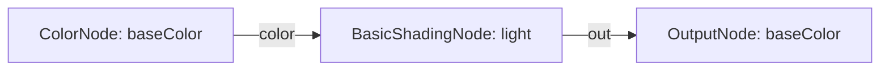

# Shader Circuit System

Computation DAG system built on `Acircuit`. Authors mathematical operations, uniform parameters, texture sampling, and surface lighting on the CPU, and delegates code generation to backend compilers.

---

## Core Model



### Separation of Circuit and Code Emission
- **Circuit and Nodes**: `ShaderNode` and `ShaderCircuit` represent pure computation topology, socket connections, and parameter definitions. Nodes and circuits contain no backend-specific keywords, string concatenation, compilation methods, or graphics API calls.
- **Direct Blueprint Definition**: The `ShaderCircuit` itself is the blueprint definition fed directly to hardware shader wrappers like `WgpuShader`.
- **Single Shader Ownership Recommendation**: It is recommended that each `ShaderCircuit` belongs to a single shader instance (1:1 relationship). Sharing a mutable circuit across multiple compiled shaders is not recommended because mutating node defaults (such as default textures) directly influences that shader's fallback bindings.
- **Hardware Shader Handle**: GPU wrappers (`WgpuShader`) consume the `ShaderCircuit` directly, compiling backend code (e.g. via `compileWgsl`) and managing hardware pipelines.

---

## Sockets

Defined in `types.ts`:

### Supported Types

```typescript
export type SocketType = "float" | "vec2" | "vec3" | "vec4" | "texture2d";
```

| Type | Dimensions | Equivalent in JS/TS | Purpose |
| :--- | :--- | :--- | :--- |
| `"float"` | Scalar | `number` | Factors, weights, opacity, thresholds |
| `"vec2"` | 2 floats | `[number, number]` | UV coordinates, 2D offsets |
| `"vec3"` | 3 floats | `[number, number, number]` | Normals, light directions, RGB vectors |
| `"vec4"` | 4 floats | `[number, number, number, number]` | RGBA colors, homogenous coordinates |
| `"texture2d"` | Object | `GpuTexture` | 2D texture handles |

### Connection Validation

Nodes enforce type compatibility during wiring via `canConnectInput`:
- Textures only connect to `"texture2d"` sockets.
- Numerics connect to numeric sockets.
- Unconnected input sockets fall back to default values defined on the target node.

---

## Nodes by Domain

Organized under `nodes/`:

### Base

File: `nodes/base.ts`

`ShaderNode` extends `Acnode` from `Atoolkit/acircuit`. Manages input sockets, output sockets, display names, and categories (`"input"`, `"math"`, `"color"`, `"shading"`, `"output"`).

### Color

File: `nodes/color.ts`

#### ColorNode
Emits a `vec4` color. Operates as an inline constant or registers a uniform parameter when `isParam: true` or `paramName` is set.
- Inputs: None.
- Outputs: `"color"` (`vec4`), `"rgb"` (`vec3`), `"alpha"` (`float`).
- Default: `[1, 1, 1, 1]`.

#### ConstColorNode
Dedicated inline constant color node. Guaranteed to emit compile-time literals without allocating uniform buffer space.

#### TextureSampleNode
Samples a 2D texture at specified UV coordinates.
- Inputs: `"uv"` (`vec2`, fallback: vertex UV).
- Outputs: `"color"` (`vec4`), `"rgb"` (`vec3`), `"alpha"` (`float`).
- Parameters: Binds a texture and sampler pair in the backend layout.

#### BlendNode (ColorMixNode)
Combines two color inputs using selectable arithmetic or interpolation modes:
- `0`: Multiply (`a * b`)
- `1`: Add (`clamp(a + b, 0.0, 1.0)`)
- `2`: Subtract (`clamp(a - b, 0.0, 1.0)`)
- `3`: Mix / Linear Interpolation (`mix(a, b, factor)`)
- `4`: Solo A (`a`)
- `5`: Solo B (`b`)
- `6`: Divide (`clamp(a / max(b, 0.0001), 0.0, 1.0)`)
- Inputs: `"a"` (`vec4`), `"b"` (`vec4`), `"mode"` (`float`), `"factor"` (`float`).
- Output: `"out"` (`vec4`).

### Math

File: `nodes/math.ts`

#### FloatNode
Emits a scalar float. Operates as an inline constant or registers a uniform parameter when `isParam: true` or `paramName` is set.
- Inputs: None.
- Output: `"value"` (`float`).

#### ConstFloatNode
Dedicated inline constant float node with zero uniform buffer allocation.

#### MathNode
Component-wise arithmetic between two `vec4` inputs.
- Operations: `"add"`, `"multiply"`, `"subtract"`, `"divide"`.
- Inputs: `"a"` (`vec4`), `"b"` (`vec4`).
- Output: `"out"` (`vec4`).

#### MixNode
Linear interpolation between two `vec4` inputs: `a * (1 - factor) + b * factor`.
- Inputs: `"a"` (`vec4`), `"b"` (`vec4`), `"factor"` (`float`, default: `0.5`).
- Output: `"out"` (`vec4`).

### Parameters

File: `nodes/params.ts`

#### ShaderParamProvider and isShaderParam
Contract implemented by nodes that register uniform buffer allocations or texture bindings:
```typescript
export interface ShaderParamProvider {
    readonly isParam: boolean;
    readonly paramName?: string;
}
export function isShaderParam(node: unknown): node is ShaderParamProvider;
```

* **`isParam`**: Flags whether the node declares a mutable uniform buffer entry or texture binding slot.
* **`paramName`**: Parameter key used for runtime overrides on `ShaderCmp`. Defaults to the node ID if omitted.

#### ParamVec4Node
Dedicated uniform parameter node for `vec4` values. Aligned to 16 bytes.
- Outputs: `"color"` (`vec4`), `"rgb"` (`vec3`), `"alpha"` (`float`).

#### ParamFloatNode
Dedicated uniform parameter node for `float` values. Aligned to 4 bytes.
- Output: `"value"` (`float`).

### Shading

File: `nodes/shading.ts`

#### BasicShadingNode
Calculates directional key light, fill light, and ambient illumination based on the interpolated vertex normal.
- Inputs:
  - `"color"` (`vec4`): Surface color input (single wire).
  - `"ambient"` (`float`, default: `0.28`): Ambient illumination scalar.
  - `"diffuse"` (`float`, default: `0.72`): Key light diffuse multiplier.
  - `"lightDir"` (`vec3`, default: `[0.5, 0.8, 0.6]`): Direction to main light source.
- Output: `"out"` (`vec4`).

### Output

File: `nodes/output.ts`

#### OutputNode
Terminal sink node of a shader graph, accessible via `graph.outputNode`.
- Inputs:
  - `"baseColor"` (`vec4`, fallback: `vec4(1.0)`): Surface color.
  - `"alpha"` (`float`, optional): Opacity factor.
  - `"emissive"` (`vec3`, optional): Emissive contribution.

---

## Compilation and Memory Layout

Handled through `ShaderCircuit` and backend compilers:

### 1. Topological Sorting
`circuit.getExecutableNodes()` traverses backwards from `outputNode`, pruning unlinked dead branches and ordering contributing nodes via `Acircuit`.

### 2. Parameter Uniqueness Validation
`circuit.validateParams(diag)` checks that all active uniform nodes and texture sample nodes declare unique `paramName` values. Collisions record diagnostic error `ERR_DUPLICATE_SHADER_PARAM` to `diag` and cause compilation to return `null`.

### 3. Memory Layout Calculation
`circuit.buildParamLayout(sortedNodes)` calculates:
- Vector parameters (`vec4`): 16-byte alignment.
- Float parameters (`float`): 4-byte alignment.
- Total uniform buffer byte size: rounded up to a 16-byte boundary.
- Default uniform data buffer: contiguous `Float32Array` populated with parameter defaults.
- Texture binding indices: sequential texture and sampler slot assignments.

### 4. Backend Shader Compilation
Hardware wrappers compile the circuit directly. For example, `WgpuShader` calls `compileWgsl(circuit, options)`:

```typescript
// WgpuShader compiles the circuit directly
const shader = new WgpuShader(circuit);
```

Returns `CompiledWgsl`:
```typescript
export interface CompiledWgsl {
    codeStatic: string;
    codeSkinned: string;
    paramLayout: ShaderParamLayout;
    textureNodes: TextureSampleNode[];
}
```

* **`codeStatic` / `codeSkinned`**: Emitted WGSL source strings for rigid (stride 32) and skinned (stride 64) vertex configurations.
* **`paramLayout`**: Uniform buffer byte offsets, total buffer allocation size, and default value payload.
* **`textureNodes`**: Array of texture sample nodes defining fragment shader texture and sampler binding slots.

---

## Runtime Integration

### Hardware Pipeline Binding

Pass the `ShaderCircuit` directly to `WgpuShader`:

```typescript
const shader = new WgpuShader(circuit);
```

### Parameter Inspection API

Universal methods on `GpuShader`:

```typescript
// Parameter names
const names = shader.getParamNames(); // ["baseColor", "roughness", "mainTexture"]

// Check existence
const exists = shader.hasParam("baseColor");

// Default values
const defaultColor = shader.getDefaultParam("baseColor");

// Cloned parameter record populated with defaults
const defaultRecord = shader.createDefaultParams();

// ECS component with parameter overrides
const paramsCmp = shader.createParamsCmp({ roughness: 0.2 });
```

### Shader Component Integration
 
Assign shaders and parameter overrides to entities via `ShaderCmp`:

```typescript
const shaderCmp = new ShaderCmp(shader, {
    baseColor: [1.0, 0.0, 0.0, 1.0],
});

// Update parameter at runtime without recompiling shaders
shaderCmp.setParam(0, "baseColor", [0.0, 1.0, 0.0, 1.0]);
```
